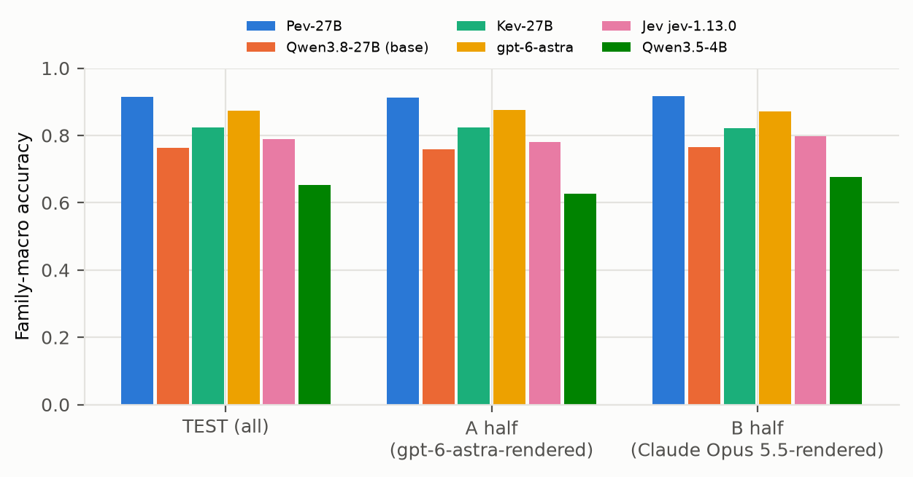
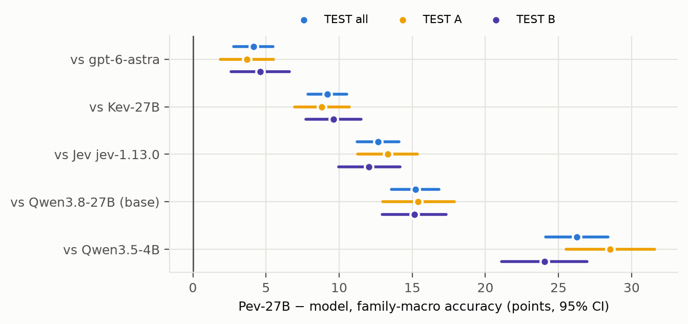
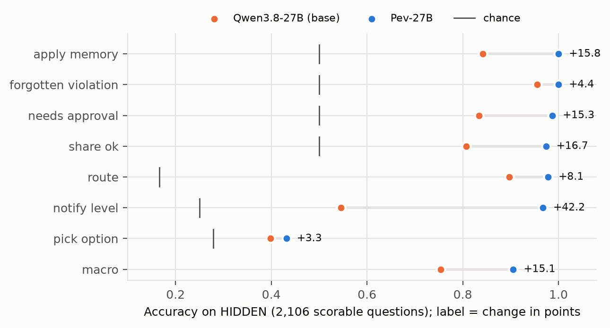
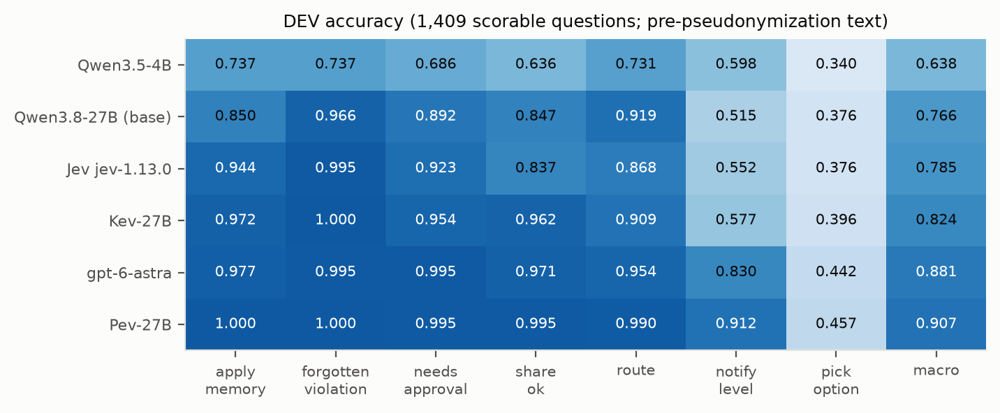

# Pev-Bench

[Paper (PDF)](../docs/tech-report/pev.pdf) ·
[Code](https://github.com/EnvLoop/Pev) ·
[Model](https://huggingface.co/EnvLoop/Pev-27B-LoRA) ·
[Leaderboard](https://huggingface.co/spaces/EnvLoop/Pev-Leaderboard) ·
[Collection](https://huggingface.co/collections/EnvLoop/pev-6abf32b6b1940477ad4c52c3)

**Pev-Bench**: decision records for a personal agent with long-term memory (MUSE-style), built from **real
public behaviour** plus **synthetic personal rules**, rendered into natural text by an LLM and verified against a
structured knowledge base. Each record is one `state` (memory, current requests, candidate actions, sometimes 1k–6k
tokens of distractor text) with 1–3 typed questions and their labels. Code, pre-registration and the technical report
are in the [Pev repository](https://github.com/EnvLoop/Pev); the model trained on it is
[Pev-27B](https://huggingface.co/EnvLoop/Pev-27B-LoRA). Authors: EnvLoop Research (research@envloop.ai).


## Results on Pev-Bench

Each model was run once on TEST (720 new users, 980 states, 2,156 scorable questions); full tables in the [model card](https://huggingface.co/EnvLoop/Pev-27B-LoRA) and the technical report.



*TEST family-macro accuracy per model, overall and per renderer half (A: gpt-6-astra, B: Claude Opus 5.5).*



*Pev-27B minus each model on TEST, family-macro accuracy with paired 95% CIs, overall and per half.*



*Per-family accuracy on HIDDEN for the base model (orange) and Pev-27B (blue), with chance marks.*



*DEV accuracy per family and predictor.*

## Splits

| Split | Records (states) | Questions | Scorable (unique label) | Users | Renderer | Use |
|---|---|---|---|---|---|---|
| `train` | 1,970 | 5,001 | 4,341 | 1,331 | gpt-6-astra | training (Pev-Bench part only; see "General mix") |
| `val` | 357 | 897 | 784 | 251 | gpt-6-astra | temperature / threshold fitting, hill-climbing analysis |
| `dev` | 630 | 1,626 | 1,409 | 428 | gpt-6-astra | model selection (scores only during development) |
| `test` (`test_a`, `test_b`) | 980 (490 + 490) | 2,506 (1,252 + 1,254) | 2,156 (1,073 + 1,083) | 654 of 720 (325 + 329) | A: gpt-6-astra, B: Claude Opus 5.5 | final comparison, one run per model; **evaluation only** |

Users are disjoint across splits (split by user id before any generation). The one-shot HIDDEN gate set used during
development is not released. Questions per family are balanced by construction (labels, answer positions). "Users"
counts distinct pseudonymous users that appear in records (TEST drew 720 new users; 654 appear in a kept record).

Also included: `general_mix_ids.jsonl` — for each of the 1,747 Kev general-mix records the adapter was trained on (not
redistributed, see below): source, revision, row, question count, text/row/record SHA-256 and position in the original
training file, so a rebuild with `scripts/general_mix.py` can be checked.

**TEST** was built by an independent builder after the model was frozen (amendment 6 of the pre-registration):
720 users not in any other split, the same generator and public styles as DEV, half the users rendered by gpt-6-astra
(`test_a`, ids `muse/test-a/…`) and half by Claude Opus 5.5 under the same rendering contract (`test_b`,
`muse/test-b/…`). It was pseudonymized **before** any model was scored; `cat test_a.jsonl test_b.jsonl` is
byte-identical to the scored file (SHA-256 `131d092796bb518b3134eef5ca9fe3f86ec9b6ae5535de6483f8e47a25e279a3`).
`pick_option` on TEST has a residual "priciest" shortcut (0.347 vs a chance of 0.276; A +10.9, B +2.9 points), reported
next to every `pick_option` result (amendment 7).

## Format

```json
{"id": "muse/val/12/4",
 "state": "Current time=21/11/2021 15:16\n\ntype: memory\n...",
 "questions": {"pick_option": {"type": "choice", "instructions": "...", "criteria": {"<option>": "<description>", "...": "..."},
                               "label": "<option>", "src": "muse/pick_option"},
               "share_ok": {"type": "noul", "criteria": {"true": "...", "false": "..."}, "label": true, "...": "..."},
               "notify_level": {"type": "score", "criteria": ["silent: ...", "digest: ...", "notify: ...", "interrupt: ..."],
                                "label": 2, "soft_label": {"0": 0.3333, "1": 0.3333, "2": 0.3333}, "...": "..."}},
 "meta": {"user_id": "<pseudonym>", "state_id": "val/12/4", "families": {"...": "..."},
          "anchors": {"<qid>": {"required": ["<verbatim evidence>"], "forbidden": []}},
          "variants": {"<qid>": "clean | override | removed | buried+..."},
          "render": {"model": "gpt-6-astra", "style_id": "pub-kv-log", "prompt_sha256": "..."},
          "release": {"anonymized": true, "replacements": {"person_name": 3}}}}
```

`meta.release.anonymized: true` marks a record that went through the pseudonymization pass (the field name predates
the wording; the records are pseudonymized, not anonymized). `meta.render.model` is `gpt-6-astra` or
`claude-opus-5-5`.

Labels follow Kev: choice = option name, yes/no = `true`/`false`, score = zero-based level. A `soft_label` whose
maximum is tied marks an *ambiguous* question (evidence removed): it counts only for Brier/ECE/NLL, never for accuracy
or training. `meta.anchors` lists the verbatim evidence each label rests on; every record passed the anchor check.

## How it was built

1. **Sources** (normalised by `scripts/acquire/`): Amazon Reviews 2023 (5 categories) and Google Local 2021 (food
   businesses in DC, DE, RI) for real users' histories; OpenFlights for airports/routes; the Enron corpus (20,000
   sampled emails, addresses/phones/URLs scrubbed) as distractor text.
2. **Knowledge base**: per user, the first 60% of the time-ordered history becomes memory (with facts extracted from
   the review text, verbatim evidence required), later interactions are real choices. **Synthetic, seeded per user**:
   approval rules, privacy levels, contacts (fictional names at `example.com`), calendar, notification rules,
   forget requests, connected services.
3. **Questions**: 7 deterministic families read only the KB (labels never come from an LLM or from any model's
   correctness). Hard variants: preference overrides, removed evidence (soft labels), buried evidence.
4. **Rendering**: gpt-6-astra turns the structured state into natural text in one of 9 public styles (key-value
   logs, chat, email threads, journals, Chinese notes, …); every required anchor must appear verbatim and every
   forbidden anchor must be absent, or the state is dropped. TEST-B uses Claude Opus 5.5 with the same contract.
5. **Validity**: oracle, null baselines (majority, constant position, shuffled labels) and shortcut baselines per
   family; known residual shortcuts in `pick_option` are reported (DEV centroid +2.5, HIDDEN medoid +3.3, TEST
   "priciest" +7.1 points over chance).
6. **Release export**: `personal-decisions export-release` (below).

## Pseudonymization

Names and user ids are **pseudonymized for readability and consistency**; this is not anonymization. The key is
published (`release/pseudonym_key.txt` in the code repository) so the export is exactly reproducible from the public
source datasets; the mapping is therefore reversible. All source data were already public.

- `meta.user_id` = HMAC-SHA256(key, internal id)[:16].
- Person names detected in states and instructions -> keyed pseudonyms of the same shape, consistently within and
  across records; emails, phones, URLs and street addresses -> `[EMAIL]`/`[PHONE]`/`[URL]`/`[ADDRESS]`.
- Options, labels and soft labels are never changed; anchors are rewritten consistently and re-checked.
- Effect: 7,054 names in `train`, 1,218 in `val`, 2,071 in `dev`, 2,081 + 1,635 in `test_a` + `test_b`, almost all
  inside Enron distractor emails (per-file receipts in `docs/DATA.md` of the code repository).
- Limits: the name detector is rule-based. Strings it still flags after the pass ("residual detections": train 10
  names + 1 address, val 4, dev 2, test 7) were reviewed for TEST: none is an unreplaced name of a real person (a
  pseudonym next to an adjacent capitalised word, or a product name). Its recall is limited: names written "Last,
  First" (frequent in Enron distribution lists), all-capital names and names outside its first-name list are **not**
  replaced. They occur almost only in the Enron distractor text, a public corpus.

> The DEV/VAL numbers in the technical report and the results were computed on the **pre-pseudonymization** text.
> The released `val`/`dev` are the pseudonymized versions (options and labels unchanged), so re-running on them may
> differ slightly. The headline comparisons are on `test`, which was pseudonymized **before** scoring (released TEST == scored TEST).

## General mix (not included)

The released adapter was also trained on 1,860 general decision questions from Kev's `evals/decision-v2/train.jsonl`
(commit `0fe8fc97`). Those rows contain text from AG News, Amazon-multi, Banking77, BoolQ, DBpedia-14, IMDB, MNLI,
SST-5, TREC and Yelp under their own terms (several forbid redistribution), so they are **not** in this dataset;
`scripts/general_mix.py` rebuilds them (seed 20261004, leakage audit included).

## Personal and sensitive information

- Records quote real public reviews verbatim (about 62% of records) and real Enron emails (buried distractors in about
  25% of records). A web search for a quoted review can find the original post and its author's public profile. Do
  not attempt to identify people.
- **Everything about a user other than their reviews is synthetic**: approval thresholds, privacy settings, contacts,
  calendars, notification rules and forget requests were generated from a seed, not observed. Nothing in a record
  says anything true about the real reviewer beyond what their public reviews say.
- Removal requests: research@envloop.ai. We remove a user's or an email's records on request and publish a new
  revision.

## Licensing and attribution

Research use only, gated (see `LICENSE.md`):

- Our contributions (structure, labels, synthetic rules, rendered wording): **CC-BY-NC-4.0**.
- Third-party text quoted in the records remains under its owners' terms: Amazon Reviews 2023 and Google Local 2021
  (UCSD McAuley Lab, released for research), Enron corpus (CMU research release).
- Contains information from [OpenFlights](https://openflights.org/data.php), made available under the Open Database
  License (ODbL 1.0); the records are a Produced Work of it. The derived airport/route tables are not distributed;
  `scripts/acquire/openflights.py` and `personal-decisions build` rebuild them.
- Rendered by gpt-6-astra (TRAIN, VAL, DEV and TEST-A) and Claude Opus 5.5 (TEST-B). `val`, `dev` and `test` are
  evaluation splits; **TEST-B (`test_b.jsonl`) is for evaluation only and must not be used to train models.**

## Citation

```bibtex
@techreport{envloop_pev,
  title       = {Pev: A Calibrated Fast-Decision Model for Personal Agents},
  author      = {{EnvLoop Research}},
  institution = {EnvLoop},
  url         = {https://github.com/EnvLoop/Pev}
}
```

Please also cite the data sources and models listed under [References](#references). Contact and removal
requests: research@envloop.ai.

## References

- Y. Hou, J. Li, Z. He, A. Yan, X. Chen, J. McAuley.
  [Bridging Language and Items for Retrieval and Recommendation](https://arxiv.org/abs/2403.03952). 2024.
  Amazon Reviews 2023 ([dataset page](https://amazon-reviews-2023.github.io/)).
- J. Li, J. Shang, J. McAuley.
  [UCTopic: Unsupervised Contrastive Learning for Phrase Representations and Topic Mining](https://aclanthology.org/2022.acl-long.426/).
  ACL 2022 (Google Local).
- A. Yan, Z. He, J. Li, T. Zhang, J. McAuley.
  [Personalized Showcases: Generating Multi-Modal Explanations for Recommendations](https://dl.acm.org/doi/10.1145/3539618.3592036).
  SIGIR 2023 (Google Local).
- B. Klimt, Y. Yang.
  [The Enron Corpus: A New Dataset for Email Classification Research](https://doi.org/10.1007/978-3-540-30115-8_22).
  ECML 2004.
- OpenFlights. [Airport, airline and route data](https://openflights.org/data.php). ODbL 1.0.
- J. Palmer. [Kev: Small Jev-like decision models you can train and run yourself](https://github.com/jaredpalmer/kev).
- Qwen Team. [Qwen3.8-27B](https://huggingface.co/Qwen/Qwen3.8-27B). Hugging Face model card.
