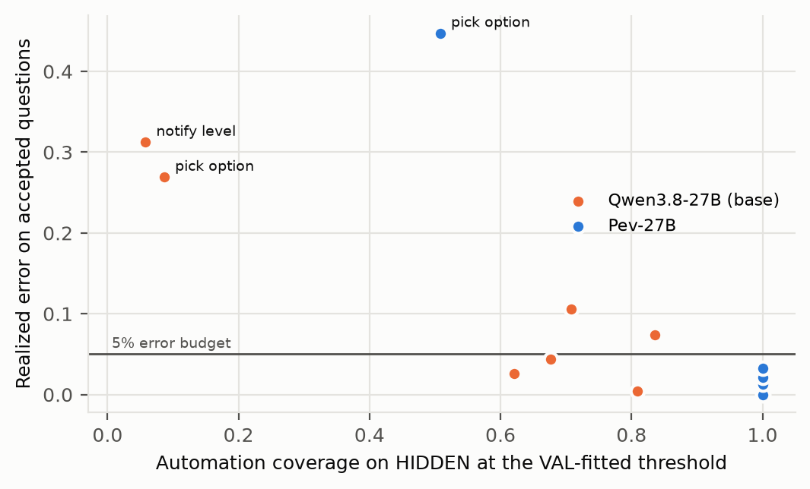
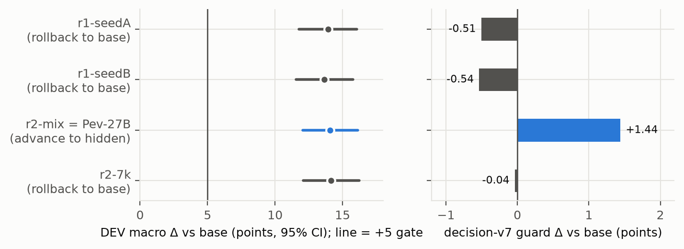

# Pev-27B

[Paper (PDF)](../docs/tech-report/pev.pdf) ·
[Code](https://github.com/EnvLoop/Pev) ·
[Dataset](https://huggingface.co/datasets/EnvLoop/Pev-Bench) ·
[Leaderboard](https://huggingface.co/spaces/EnvLoop/Pev-Leaderboard) ·
[Collection](https://huggingface.co/collections/EnvLoop/pev-6abf32b6b1940477ad4c52c3)

**Pev-27B** is a LoRA adapter for [Qwen3.8-27B](https://huggingface.co/Qwen/Qwen3.8-27B) (revision
`1d4bf0f2ff6012fd82039f2fa52739d0dd7c60c0`) that answers typed decision questions for a personal agent with long-term
memory, with calibrated probabilities. It was trained and evaluated on
[Pev-Bench](https://huggingface.co/datasets/EnvLoop/Pev-Bench); code, pre-registration, results and the
technical report are in the [Pev repository](https://github.com/EnvLoop/Pev). Authors: EnvLoop Research
(research@envloop.ai).

- Unpacked from the frozen training output `qwen-adapter.tar.gz`, SHA-256
  `6b07a7d36eba59b9cfd9cf440bdc5783f4fc12d4d726cfa5beef2462860d8d81` (per-file hashes in `release-manifest.json`).
- Frozen as the final candidate after two hill-climbing rounds; passed the one-shot pre-registered HIDDEN gate; then
  compared once with five other models on a public TEST set.


## Files

| File | What |
|---|---|
| `adapter_config.json`, `adapter_model.safetensors` | The LoRA (PEFT 0.21; r 16, alpha 32; 992 tensors) |
| `tokenizer.json`, `tokenizer_config.json`, `chat_template.jinja` | Saved with the adapter; identical in use to the base model's tokenizer and chat template |
| `temperature.json` | Calibration temperature fitted on VAL by NLL: **T = 2.772** |
| `thresholds.json` | Automation threshold for a 5% error budget, fitted on VAL: **0.369** |
| `usage_example.py` | Loads base + adapter and prints the calibrated distribution for each question of a record |
| `release-manifest.json` | Archive and per-file SHA-256, base revision, template hash, training-row hash |

## How it is used

One question per prompt. The prompt is the base model's chat template (thinking disabled) around the frozen
`direct` template (`packages/decision-eval/decision_eval/templates/direct.txt` in the code repository): the state, the
question, and the options with single-token labels — `A`, `B`, … for choices, `no`/`yes` for yes/no questions, `0`…`3`
for scores. The prediction is the softmax over the label tokens' next-token log-probabilities divided by the
temperature fitted on VAL (**T = 2.772** for this adapter; **T = 1.675** for the zero-shot base). Do not use free
generation: build prompts with the code repository's `render_prompt`, which renders them byte-identically to training
and evaluation.

```python
# pip install "decision-eval @ git+https://github.com/EnvLoop/Pev#subdirectory=packages/decision-eval"
import json, torch
from huggingface_hub import snapshot_download
from peft import PeftModel
from transformers import AutoModelForCausalLM, AutoTokenizer
from decision_eval.conventions import question_keys
from decision_eval.prompts import MODEL, REVISION, render_prompt, verify_labels   # Qwen/Qwen3.8-27B @ 1d4bf0f2

adapter = snapshot_download("EnvLoop/Pev-27B-LoRA")
tok = AutoTokenizer.from_pretrained(MODEL, revision=REVISION)
base = AutoModelForCausalLM.from_pretrained(MODEL, revision=REVISION, dtype=torch.bfloat16, device_map={"": "cuda"})
model = PeftModel.from_pretrained(base, adapter, is_trainable=False).eval()
T = json.load(open(f"{adapter}/temperature.json"))["temperature"]             # 2.772, fitted on VAL

record = json.loads(open("test_a.jsonl").readline())                         # a record from EnvLoop/Pev-Bench
for qid, q in record["questions"].items():
    prompt, labels = render_prompt(record, qid, "direct", tok)               # frozen template, thinking disabled
    label_ids = verify_labels(tok, labels)                                   # one token per option label
    ids = tok(prompt, add_special_tokens=False, return_tensors="pt").input_ids.to(model.device)
    with torch.no_grad():
        logits = model(input_ids=ids, logits_to_keep=1).logits[0, -1].float()
    probs = torch.softmax(torch.log_softmax(logits, -1)[label_ids] / T, -1)  # calibrated distribution
    print(qid, dict(zip(question_keys(q["type"], q.get("criteria")), probs.tolist())), "label:", q.get("label"))
```

`usage_example.py` is the same code as a script. For whole files use the evaluator, which batches and checkpoints:

```bash
uv run --project packages/decision-eval predict-base --model Qwen/Qwen3.8-27B \
    --revision 1d4bf0f2ff6012fd82039f2fa52739d0dd7c60c0 --template direct --adapter ./adapter \
    --data records.jsonl --out preds.jsonl
```

Deployment guidance from the evaluation: automate a decision only when its calibrated max-probability clears the VAL
threshold for a 5% error budget (`thresholds.json`); **always ask the user for `pick_option`** — its VAL threshold
over-automates (realized error 43.8% on DEV, 44.7% on HIDDEN and 37% on TEST against the 5% budget).

## Training

| | |
|---|---|
| Method | SFT on the option-label token only: input = prompt ids (exactly what the evaluator scores) + 1 label token; loss = NLL of the label token; no EOS; no truncation |
| LoRA | r 16, alpha 32, dropout 0.05, bias none; attention `q/k/v/o_proj`, Gated DeltaNet `linear_attn.in_proj_qkv/z/a/b, out_proj`, MLP `gate/up/down_proj` (all layers) |
| Optimisation | AdamW (torch), lr 5e-5, cosine, 24 warmup steps, 776 steps, batch 1 x grad. accumulation 8 (~1 epoch), bf16, gradient checkpointing, seed 20260930, max length 12,288 |
| Data | 6,201 SFT rows: 4,341 from 1,970 Pev-Bench TRAIN records (5,001 questions; 660 with tied soft labels excluded) + 1,860 general decision questions (30% of rows) from Kev `evals/decision-v2/train.jsonl` @ `0fe8fc97`, leakage-audited against DEV, VAL and the guard (SFT rows SHA-256 `046a2ddb…`) |
| Compute | 1 x H100 80 GB, ~2.75 h, ~USD 11 for this run (the GPU cost of the whole project is itemized in the technical report, Appendix D) |
| Reproduce | `training/train_text_choice.py` with `training/configs/qwen3.8-27b-r2-mix-s20260930.json` (transformers 5.17.0, peft 0.21.x, torch 2.14.0) |

The original run used an internal trainer (TRL `SFTTrainer` 1.14 with pre-tokenized rows); the open script reproduces
its data handling, loss and optimisation. Bitwise-identical weights are not expected (kernels, LoRA initialisation).
Retraining on the released TRAIN will not hash-match the original rows: the released records are pseudonymized
(distractor names, user ids) and the Kev mix is rebuilt by script.

## Evaluation

All numbers are family-macro accuracy (7 families, equal weight; questions with tied soft labels excluded), paired
state-clustered bootstrap (10,000 resamples, seed 20260930).

**TEST (public; 980 states from 720 new users, 2,156 scorable questions; half A rendered by gpt-6-astra, half B by
Claude Opus 5.5; pseudonymized before scoring; every model run once).** Adapter − model with 95% CI, Holm-corrected
over the five comparisons (Holm-adjusted p = 5 × 10⁻⁴ in every column):

| Model | All | A half | B half | Adapter − model, all | Without `pick_option` (6 families) |
|---|---|---|---|---|---|
| **Pev-27B** | **0.915** | **0.913** | **0.917** | — | **0.987** |
| gpt-6-astra | 0.873 | 0.876 | 0.871 | +4.1 [+2.8, +5.5] | 0.945 (+4.2 [+3.1, +5.3]) |
| Kev-27B | 0.823 | 0.825 | 0.821 | +9.2 [+7.8, +10.5] | 0.888 (+9.9 [+8.7, +11.2]) |
| Jev (`jev-1.13.0`) | 0.788 | 0.779 | 0.797 | +12.7 [+11.2, +14.1] | 0.851 (+13.7 [+12.2, +15.1]) |
| Qwen3.8-27B (base, B0) | 0.762 | 0.759 | 0.766 | +15.2 [+13.6, +16.8] | 0.818 (+16.9 [+15.4, +18.6]) |
| Qwen3.5-4B | 0.652 | 0.627 | 0.677 | +26.3 [+24.1, +28.4] | 0.686 (+30.1 [+27.9, +32.3]) |

Per family (adapter): apply_memory 1.000, forgotten_violation 0.997, needs_approval 0.993, share_ok 0.990, route
0.988, notify_level 0.955, pick_option 0.480 (all six models 0.41–0.48; a "priciest" shortcut scores 0.347 against a
chance of 0.276, so `pick_option` progress is not claimed). Brier 0.125, ECE 0.065, automation coverage at a 5% error
budget 0.94 (B0 0.56, Kev-27B 0.71). Safety false negatives (forgotten_violation / needs_approval / share_ok): adapter
0% / 1.3% / 2.0%; gpt-6-astra 0.7% / 0% / 0%; B0 6.0% / 4.7% / 4.6%. The lead over gpt-6-astra is +3.7 points on the
half gpt-6-astra rendered and +4.6 on the Claude Opus 5.5 half.


*TEST family-macro accuracy per model, overall and per renderer half (A: gpt-6-astra, B: Claude Opus 5.5).*


*Pev-27B minus each model on TEST, family-macro accuracy with paired 95% CIs, overall and per half.*

**HIDDEN (one-shot gate; 960 states from 720 users, 2,106 scorable of 2,456 questions; not released)**: base 0.754 ->
adapter **0.905** (+15.1, CI95 [+13.5, +16.8], one-sided p = 1 × 10⁻⁴; McNemar 359 vs 48). Per family (base ->
adapter): apply_memory 0.84 -> 1.00, forgotten_violation 0.96 -> 1.00, needs_approval 0.83 -> 0.99, share_ok 0.81 ->
0.97, route 0.90 -> 0.98, notify_level 0.55 -> 0.97, pick_option 0.40 -> 0.43 (n.s.). Automation coverage at 5%
error 0.54 -> 0.93.


*Per-family accuracy on HIDDEN for the base model (orange) and Pev-27B (blue), with chance marks.*



*Coverage and realized error per family on HIDDEN at the VAL-fitted thresholds; the line is the 5% error budget.*

**DEV (630 states, 1,409 scorable)**: 0.766 -> **0.907** (+14.1). Brier 0.261 -> 0.131, ECE 0.074 -> 0.066,
coverage at 5% error 0.57 -> 0.93. Regression guard (Kev decision-v7 test): 0.834 -> 0.848 (partly in-distribution:
the general mix comes from the same suite's train split). References on DEV: Qwen3.5-4B 0.638, Jev 0.785, Kev-27B
0.824, gpt-6-astra 0.881; adapter − gpt-6-astra +2.7 (CI95 [+1.1, +4.2]).


*DEV accuracy per family and predictor.*



*DEV macro-accuracy gain over the base model (left) and change on the regression guard (right) for each hill-climbing candidate.*

> DEV/VAL numbers were computed on the pre-pseudonymization text; the released VAL/DEV are pseudonymized (names,
> user ids; options and labels unchanged) and were not re-scored, so re-running on them may differ slightly. TEST was
> pseudonymized before scoring (released TEST == scored TEST).

## Limitations and risks

- Rule-derived families (approval, sharing, forgetting, notification, routing) are learned from a generator with
  explicit rules; they transfer to unseen rendering styles (HIDDEN) and to an unseen renderer (TEST half B), but real
  deployments have messier rules.
- `pick_option` (predicting real choices from review history) is essentially unsolved (~0.43–0.48 vs ~0.28 chance).
- English-centric data with some Chinese / mixed-language rendering styles.
- The training data quote real public reviews and Enron emails (pseudonymized); the model may reproduce fragments.
- Not a safety system: approval/sharing predictions must be backed by hard rules in an agent.

## Training-data provenance and terms (summary; see the dataset card)

Amazon Reviews 2023 and Google Local 2021 (UCSD McAuley Lab; no explicit licence, research use, cite), Enron email
corpus (CMU; distractor text, pseudonymized), OpenFlights (ODbL 1.0; produced work), text rendered and memory facts
extracted by gpt-6-astra, Kev decision-v2 train rows (Kev code Apache-2.0; the rows contain AG News, Amazon-multi,
Banking77, BoolQ, DBpedia-14, IMDB, MNLI, SST-5, TREC and Yelp text under their own terms). No TEST data,
Claude Opus 5.5-rendered text or Jev output was used for training.

## Licence

Research use only, gated: the adapter weights are released under CC-BY-NC-4.0 with the additional conditions in
`LICENSE.md` (non-commercial research; no attempt to identify people quoted in the training data; cite the sources).
The base model `Qwen/Qwen3.8-27B` is Apache-2.0 and must be obtained under its own licence.

## Citation

```bibtex
@techreport{envloop_pev,
  title       = {Pev: A Calibrated Fast-Decision Model for Personal Agents},
  author      = {{EnvLoop Research}},
  institution = {EnvLoop},
  url         = {https://github.com/EnvLoop/Pev}
}
```

Please also cite the models and data sources listed under [References](#references). Contact and removal
requests: research@envloop.ai.

## References

- Qwen Team. [Qwen3.8-27B](https://huggingface.co/Qwen/Qwen3.8-27B). Hugging Face model card.
- E. J. Hu, Y. Shen, P. Wallis, Z. Allen-Zhu, Y. Li, S. Wang, L. Wang, W. Chen.
  [LoRA: Low-Rank Adaptation of Large Language Models](https://openreview.net/forum?id=nZeVKeeFYf9). ICLR 2022.
- J. Palmer. [Kev: Small Jev-like decision models you can train and run yourself](https://github.com/jaredpalmer/kev)
  and [Kev-27B](https://huggingface.co/jaredpalmer/kev-27b).
- Y. Hou, J. Li, Z. He, A. Yan, X. Chen, J. McAuley.
  [Bridging Language and Items for Retrieval and Recommendation](https://amazon-reviews-2023.github.io/)
  (Amazon Reviews 2023). 2024.
- J. Li, J. Shang, J. McAuley.
  [UCTopic: Unsupervised Contrastive Learning for Phrase Representations and Topic Mining](https://aclanthology.org/2022.acl-long.426/).
  ACL 2022 (Google Local).
- A. Yan, Z. He, J. Li, T. Zhang, J. McAuley.
  [Personalized Showcases: Generating Multi-Modal Explanations for Recommendations](https://dl.acm.org/doi/10.1145/3539618.3592036).
  SIGIR 2023 (Google Local).
- B. Klimt, Y. Yang.
  [The Enron Corpus: A New Dataset for Email Classification Research](https://doi.org/10.1007/978-3-540-30115-8_22).
  ECML 2004.
- OpenFlights. [Airport, airline and route data](https://openflights.org/data.php). ODbL 1.0.
