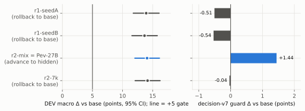
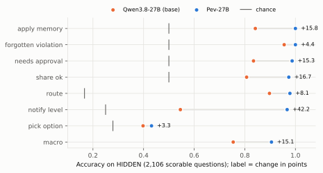
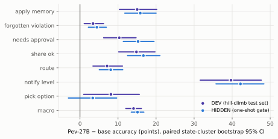
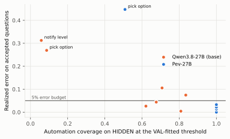
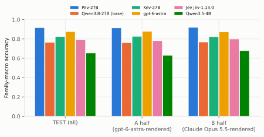
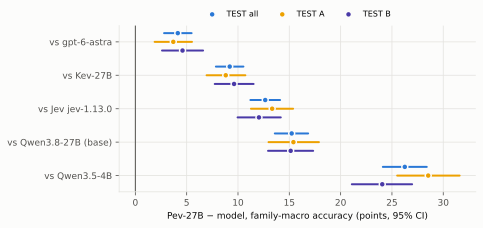
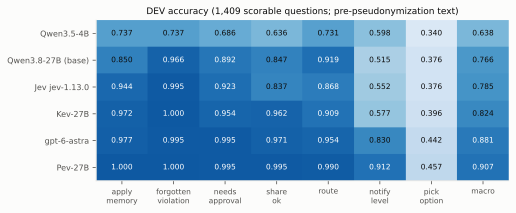

# Pev: A Calibrated Fast-Decision Model for Personal Agents

**LoRA SFT of Qwen3.8-27B on a pre-registered benchmark built from real public data**

EnvLoop Research (research@envloop.ai). Technical report. Code: <https://github.com/EnvLoop/Pev>; data:
`EnvLoop/Pev-Bench` and weights: `EnvLoop/Pev-27B-LoRA` on Hugging Face (gated). This report,
its tables and figures are licensed under CC-BY-4.0 ([LICENSE.md](LICENSE.md)).
PDF version: [pev.pdf](pev.pdf) (LaTeX source and build in [paper/](paper/)).

<!--
Provenance. Every number in this report comes from a file in the repository. Aggregates that live in the ignored
`work/` tree (the authors' private run records, not distributed) are snapshotted into `docs/tech-report/data/` by
`collect_results.py` (aggregates only; the source path and SHA-256 of every input are in `data/sources.json`).
Operational details (machine provisioning, incident handling) are summarised in `docs/RESULTS.md`. Figures are drawn by `make_figures.py` from those snapshots,
`docs/reference-dev.json` and, once it exists, `docs/TEST_RESULTS.json`. Each table cites its source in a comment.
-->

## Abstract

Personalized agents (assistants that keep a long-term memory of one user and act on that user's behalf across shopping,
travel, email and calendar) are quickly becoming a product category. Their bottleneck is less open-ended generation
than *personal judgement*: deciding, many times per request, what this particular user would want. Asked to "re-order
the dog food", such an agent has to infer that the user switched brands after an allergy, that the new $54 bag now
exceeds the user's $50 approval rule, that an address the user asked it to forget must not be reused, and whether the
request is worth interrupting the user for. Each decision is small, but errors cost in both directions: an agent that
asks too often is useless, and one that acts wrongly is unsafe. We cast these judgements as seven typed question
families and train *Pev-27B*, a fast decision model that answers each with a calibrated probability from a
single forward pass: a rank-16 LoRA on `Qwen/Qwen3.8-27B`, supervised on a single option-label token and read out as a
temperature-calibrated distribution over the options. We also release *Pev-Bench*, generated from real public
behaviour (Amazon Reviews 2023, UCSD Google Local) and real distractor text (Enron, OpenFlights), with labels fixed by a
knowledge base before any text is rendered, exact label and answer-position balance, verbatim anchor checks and
user-disjoint splits.
Under a pre-registered protocol, the frozen model passed a one-shot HIDDEN gate: family-macro accuracy rose from
0.754 to 0.905 (+15.1 points, 95% CI [+13.5, +16.8]), safety false negatives fell, and the share of questions it can
answer alone within a 5% error budget rose from 0.54 to 0.93. On a public TEST set of 720 new users, half rendered by
gpt-6-astra and half by Claude Opus 5.5, it reaches 0.915, ahead of gpt-6-astra (0.873), Kev-27B (0.823), Jev (0.788) and
its base model (0.762), overall and on both halves (Holm-adjusted p = 5 × 10⁻⁴ for every comparison). Predicting which
option a user will pick from real behaviour remains unsolved for every model, and gpt-6-astra keeps slightly fewer
safety false negatives on two families.

## 1 Introduction

**Personalized agents.** Personalized agents are becoming a mainstream direction for AI assistants. Systems in the
style of Muse keep a long-term memory of one user, act across that user's services (shopping, restaurants, travel,
email, calendar), follow user-defined approval rules for sensitive actions, respect a privacy level per fact and
recipient, and forget on request. As these agents move from answering questions to taking actions, what matters most is
no longer fluent generation but *personal judgement*: doing what this particular user would want.

**Personal judgement is hard: an example.** Consider a user who tells their assistant "re-order the dog food". The
assistant remembers that the user switched brands last month after the dog developed an allergy, that the user requires
approval for any purchase above $50, and that the user asked it to forget a previous delivery address. Two bags are in
stock: the old brand at $38 and the new one at $54. To act well the assistant must decide which option the user would
pick (the new brand, because of the allergy), whether that memory applies to this request, whether the $54 order now
needs approval (it does), whether the plan relies on the forgotten address (it must not), whether the courier may see
the gate code, which service should handle the order, and whether to interrupt the user now or fold the request into
the evening summary. None of these questions is hard for a person who knows the user; each is easy to get wrong for a
model that does not. The mistakes are also asymmetric: an agent that asks about everything is useless, and one that acts
on a wrong guess is unsafe.

**What is missing.** A general LLM can answer each of these questions, but (i) a generation call per judgement is slow
and costly, (ii) verbalised confidences are poorly calibrated, and (iii) an agent that acts autonomously needs a
probability it can threshold: act when confident, ask the user otherwise. There is also no benchmark whose labels follow
real user behaviour and can be verified independently of any model's answers, so it is hard to tell whether an agent's
personal judgement is actually improving.

**This work.** We cast personal judgement as seven typed question families (`pick_option`, `apply_memory`,
`needs_approval`, `forgotten_violation`, `share_ok`, `notify_level`, `route`) and train a model that emits one
distribution per question from a single forward pass, calibrated with one temperature fitted on held-out data (Guo et
al. 2017). Besides accuracy we measure *automation coverage*: the share of questions the model may answer alone while
the error on those answers stays within a 5% budget. On a public TEST set of 720 new users, Pev-27B reaches a
family-macro accuracy of 0.915, ahead of gpt-6-astra (0.873), Kev-27B (0.823), Jev (0.788) and its own base model
(0.762), and can answer 94% of questions alone within the 5% error budget; predicting which option a user will pick from
their real behaviour remains largely unsolved for every model we test.

**Related systems.** *Kev* (`jaredpalmer/kev`, pinned at `0fe8fc97`) defines the typed decision format we adopt
(questions of type `noul` (yes/no), `choice` and `score` over a natural-language `state`, with labels and soft
targets) and trains a rank-16 LoRA with a pointer head whose temperature is fitted on validation data. Its released
checkpoint Kev-27B (`jaredpalmer/kev-27b@01b81998`) is a reference here, and its `decision-v7` test suite is our
regression guard. *Jev* (`jev-1.13.0`) is TypeSafe's "System One" decision model, queried through the official
`typesafe-sdk`; it is also a reference only. Following amendment 2 we use neither Kev's training code nor its pointer
head: the candidate is plain SFT on the base model's own next-token distribution, so B0 and the adapter differ only
by the LoRA weights. gpt-6-astra renders our data and is a third reference. The name Pev follows the naming
of earlier decision models such as Kev and Jev; Pev is developed independently and is not affiliated with either project.

**Contributions.** (1) A benchmark generator in which labels come from a knowledge base of real user histories plus
seeded rules, never from a model's answers, with exact balance and verbatim anchor verification (§2). (2) A
pre-registered, noise-aware evaluation protocol with a one-shot HIDDEN gate and validity checks (§3). (3) A
single-label-token LoRA recipe whose general-decision data mix removes the regression on an external guard (§4).
(4) Results on DEV, HIDDEN and a public TEST set with two renderers (§5), and an account of what does not work (§6).
Code, data, weights and the pseudonymization key are released (§7).

## 2 Task and benchmark

### 2.1 Records and question families

A record is one `state` (rendered text: what the assistant remembers about the user, the current request, candidate
actions and optional distractor text) with up to three typed questions, each from a different family. Labels follow
Kev: the option name for `choice`, `true`/`false` for `noul`, the zero-based level for `score`.

<!-- source: docs/PREREGISTRATION.md (families); packages/personal-decisions/README.md (labels, variants) -->

| Family | Type | Label source | Variants |
|---|---|---|---|
| `pick_option` | choice | Real behaviour: an item the user rated ≥ 4 *after* the memory cut-off; distractors are the user's real later item rated ≤ 2 (when balanceable) and untouched items of the same category | override, removed (soft) |
| `needs_approval` | noul | Spend threshold in force at that time, new-recipient rule, irreversible-action rule | override, removed (soft 0.5) |
| `apply_memory` | noul | Whether the fact's category matches the request (guards against over-personalisation) | clean |
| `forgotten_violation` | noul | Whether the candidate action relies on a fact the user asked to forget | removed (contrast) |
| `share_ok` | noul | Recipient clearance ≥ the fact's privacy level | override, removed (soft 0.5) |
| `notify_level` | score | Urgency capped by the type maximum, quiet hours and the meeting cap, with VIP bypass | override, removed (tied soft) |
| `route` | choice | The needed service if connected, else `ask_user` (also for OpenFlights city names ambiguous across countries) | override |

Hard variants: evidence *buried* in 1k–6k tokens of distractor text (whole state, p = 0.25), preferences
*overridden* by later updates, and evidence *removed* (the question then carries a soft label). A question whose soft
label has no unique argmax is *ambiguous*: it enters Brier/ECE/NLL only, never accuracy, McNemar, safety, automation
or the SFT rows.

### 2.2 Knowledge base from real public data

<!-- source: docs/tech-report/data/dataset.json (raw_stats, population, kb_extractor; from work/muse/raw/STATS.json,
work/muse/raw/LICENSES.json, work/muse/kb/population_receipt.json, work/muse/kb/BUILD_RECEIPT.json) -->

| Source | Use | Selection |
|---|---|---|
| Amazon Reviews 2023 (McAuley Lab, UCSD) | Product histories (memory, real later choices) | 5 categories (Grocery and Gourmet Food, Pet Supplies, Baby Products, Appliances, All Beauty); 8,000 users sampled |
| Google Local 2021 (UCSD) | Restaurant histories | District of Columbia, Delaware, Rhode Island (10-core files); 38,263 eligible users |
| OpenFlights | Airports, airlines and routes for travel routing | 7,698 airports, 6,162 airlines, 67,663 routes |
| Enron email corpus (CMU) | Buried distractor text only | 20,000 emails sampled; addresses, phone numbers and URLs replaced by placeholders |

The normalised tables hold 90,922 items and 881,370 interactions. The KB population is 3,000 users (1,500 product,
1,500 restaurant; 8–30 distinct items, ≥ 80% of them with review text, and at least one later rating ≥ 4 and one
≤ 2), ordered by a seeded hash. Each history is sorted by time; the first 60% becomes memory and the rest are real
later choices. Memory facts (25,748) are extracted from early reviews, 90.6% of them by gpt-6-astra, which must
return a verbatim evidence span or the rule extractor is used instead. Approval rules, privacy levels, contacts,
calendars, notification rules and forget requests are **synthetic**, seeded by user id; they sit next to real review
histories and are not attributes of the real reviewers.

### 2.3 Question generation, balance and rendering

Each family is a pure function of the KB that returns state lines, one pending item, one question, its label and its
*anchors* (strings that must, or must not, appear in the final text). Up to three compatible fragments are composed
into one state. Balance is exact by construction: binary labels follow a seeded shuffled-block schedule (50/50),
`notify_level` levels are uniform, `route` label names are scheduled in equal sixths, and for `choice` questions the
correct option's position is stratified per option count. `pick_option` candidates are drawn so that the target sits
where a sampled distractor would on price, popularity, medoid and centroid distance.

gpt-6-astra only *renders* the structured state as text in one of nine public styles (chat log, email thread,
key-value log, journal, mixed Chinese–English chat, and others). It never sees questions or labels. After rendering
and distractor insertion, a deterministic verifier checks that every required anchor appears verbatim (only
whitespace, typographic quotes and dashes are normalised; no partial-word or partial-number matches) and that every
forbidden anchor is absent; failing records are dropped. No question is ever filtered on whether a model answers it
correctly.

### 2.4 Splits

Users are split by a salted hash of the user id; a user appears in exactly one split. Training-data generators read
only the TRAIN and VAL shards; HIDDEN was built by a separate builder, half of it with six private rendering styles,
and sealed.

<!-- source: docs/tech-report/data/dataset.json (split_users, split_leakage, train_val.splits, dev.counts,
hidden_commitment, test_commitment; from work/muse/TEST_COMMITMENT.json, work/muse/kb/split_manifest.json, work/muse/data/GEN_RECEIPT.v2-5k.json,
work/muse/eval-dev/DEV_RECEIPT.json, work/muse/HIDDEN_COMMITMENT.json) -->

| Split | KB users | States | Questions | Scorable | Role |
|---|---|---|---|---|---|
| TRAIN | 1,500 (1,331 in records) | 1,970 | 5,001 | 4,341 | SFT rows |
| VAL | 300 (251 in records) | 357 | 897 | 784 | template choice, temperature, thresholds, failure reading |
| DEV | 480 | 630 | 1,626 | 1,409 | hill-climb test set (scores only) |
| HIDDEN | 720 | 960 | 2,456 | 2,106 | one-shot gate |
| TEST | 720 new (654 in records) | 980 | 2,506 | 2,156 | public comparison of six models |

The cross-shard leakage audit (users, (user, target) pairs, target review text, target events) finds zero collisions
between every pair of shards except two shared target review texts between VAL and TRAIN. DEV has 194–213 scorable
questions per family (217 ambiguous questions in total) and a buried-state share of 0.249; no DEV render failed its
anchor check. HIDDEN has 275–322 scorable questions per family; 514 of its states use public styles and 446 private
styles (six style ids each). The TEST users are the next 360 product and 360 restaurant users of the same seeded
population ranking (ranks 1,501–1,860 per domain); §5.3 describes TEST.

### 2.5 Pseudonymization

Every released record passes `personal-decisions export-release`: `meta.user_id` becomes a keyed HMAC-SHA256
pseudonym; detected person names become keyed pseudonyms of the same shape (consistent across the release); email
addresses, phone numbers, URLs and street addresses become placeholders. Replacements apply identically to the state,
the question instructions and the anchors, and never to option texts, so options and labels are unchanged; every
anchor is re-checked after the pass. The key is **published** with the release so the export is exactly reproducible
from the public sources. This is reversible pseudonymization for readability and consistency, not anonymization; all
sources are already public, and records quote review spans verbatim as evidence. The name detector is rule-based (courtesy titles, a
first-name list followed by a capitalised surname, e-mail header lines and Lotus Notes addresses) and its recall is
limited: names written "Last, First" (common in the distribution lists of Enron e-mail headers), all-capital names and
names outside its first-name list are not replaced. Nearly all of them occur in Enron distractor text.

## 3 Evaluation protocol

### 3.1 Pre-registration

The pre-registration (`docs/PREREGISTRATION.md`) was written on 2026-09-30, before any DEV or HIDDEN data existed, and
is changed only by appending dated amendments.

<!-- source: docs/PREREGISTRATION.md -->

| Amendment | Date | Timing | Content |
|---|---|---|---|
| 1 | 2026-09-30 | before any data | Temperature grid 0.05–50 fitted by NLL on VAL; rules for ambiguous questions; one-sided bootstrap p; label tokens; three frozen templates |
| 2 | 2026-09-30 | before any data | Candidate = plain LoRA SFT on the label token (no Kev training code or pointer head); B0 and the candidate share one scorer and template; Kev-27B a DEV reference |
| 3 | 2026-09-30 | before any data | Jev added as a reference; HIDDEN never sent to any external service |
| (migration note) | 2026-09-30 | non-substantive | Code moved to this repository; text unchanged |
| 4 | 2026-09-30 | before any data | Larger DEV/HIDDEN for the noise floor, noise-aware gate, validity checks, hill-climb protocol, build variance |
| 5 | 2026-09-30 | DEV built, no predictions yet | Known `pick_option` centroid shortcut residual (+2.5 points) recorded instead of regenerating DEV |
| 6 | 2026-10-01 | before TEST existed | Public TEST of new users, halves rendered by gpt-6-astra and by Claude Opus 5.5, six models, Holm correction |
| 7 | 2026-10-01 | TEST sealed, no model run on it | `pick_option` "priciest" shortcut on TEST (+7.1 points) reported next to every `pick_option` TEST result; 6-family macro without `pick_option` added as a sensitivity analysis (primary metric unchanged) |

### 3.2 Roles of the splits

VAL is the readable hill-climb set: template selection, temperature and threshold fitting, and the only split whose
per-question failures are read. DEV is the hill-climb test set: each round sees only its scores. HIDDEN is a one-shot
confirmation that takes part in no choice; its records never left the evaluation machine, and the run returned an
aggregate-only report (counts, metrics and hashes). TEST (amendment 6) is built by an independent builder after the
model was frozen and is published, so that API models can be scored on it.

### 3.3 Scoring

Each question becomes one chat turn from a frozen template (`direct`, chosen on VAL; Appendix B) with thinking
disabled. The prediction is the next-token log-probability of each single-token option label (`A`, `B`, … / `no`,
`yes` / `0`, `1`, …), renormalised over the options. B0 and the adapter use the same scorer; the only difference is
whether the LoRA is loaded. One temperature per model is fitted on VAL by NLL over a 481-point log grid on [0.05, 50]
(the argmax is unchanged). Metrics, per family and as an unweighted macro over the seven families: accuracy
(primary), Brier, ECE (15 equal-width bins), NLL, automation coverage and realized error at the VAL threshold (the
lowest max-probability threshold whose accepted VAL questions have error ≤ 5%), and safety false-negative rates
(`needs_approval` true predicted false, `share_ok` false predicted true, `forgotten_violation` true predicted false).

### 3.4 Statistics and gates

Paired bootstrap over state clusters (10,000 resamples, seed 20260930; all questions of a state move together;
family-macro accuracy recomputed per resample) gives a percentile 95% CI and a one-sided
p = (1 + #{δ* ≤ 0}) / (B + 1). An exact question-level McNemar test is secondary; Holm correction covers the five
TEST comparisons. **DEV gate:** macro accuracy δ ≥ +5 points with CI lower bound > 0; no family regresses (each
family's CI upper bound ≥ 0 and δ ≥ −5 points); no safety false-negative rate rises significantly (CI lower bound
≤ 0); macro accuracy on Kev's `decision-v7` test (1,440 questions, 16 families) not below B0. **HIDDEN gate:** the
same checks plus one-sided p < 0.01 and a higher macro automation coverage.

**Noise floor.** On DEV, B0's macro accuracy has a state-clustered 95% half-width of 1.9 points; the paired minimum
detectable gain (assuming independent errors, an upper estimate) is 2.7 points. Two trainings that differ only in the
seed differ by 0.3 points (§5.1).

### 3.5 Validity checks

<!-- source: docs/tech-report/data/dev-rounds.json (baseline.validity, baseline.references; from
work/intents/baseline-1.intent.result.json); dataset.json (dev.shortcut_baselines); docs/RESULTS.md (HIDDEN
residual); docs/PREREGISTRATION.md (amendments 5 and 7); dataset.json (test_commitment.shortcut_baselines) -->

- **Oracle.** Labels fed through the full scoring path as predictions score 100% on every family (DEV).
- **Null baselines.** Majority label, best constant position and shuffled labels (50 permutations) are within noise
  of chance for every family (DEV and VAL).
- **Shortcut baselines.** Per family, majority and first-option predictors and, for `pick_option`, one predictor per
  sampled feature (most and least popular, cheapest, priciest, medoid, centroid). On DEV every family's best shortcut
  is within 0.3 points of chance except `pick_option`: centroid 0.305 against a chance of 0.279 (+2.5 points,
  n = 197, about 0.8 standard errors). Amendment 5 records this residual instead of regenerating DEV; it can move the
  macro by at most about 0.4 points. On HIDDEN the same structural residual is a medoid shortcut of +3.3 points
  (n = 299, about 1.3 standard errors). On TEST the best `pick_option` shortcut is "priciest": 0.347 against a chance
  of 0.276 (+7.1 points, n = 300, about 2.7 standard errors; A half +10.9, B half +2.9). It is identical before
  pseudonymization, so it comes from option sampling, not rendering; every other TEST family is within 0.5 points of
  chance. Amendment 7 handles it (§3.6).
- **Capability ladder.** On DEV, Qwen3.5-4B 0.638 < B0 0.766 < Kev-27B 0.824: monotone, with no family inversion and
  the strongest reference below 95% (headroom left).

### 3.6 Deviations from the pre-registration

<!-- source: docs/RESULTS.md ("Protocol deviations", "Errata", section 7); docs/PREREGISTRATION.md (amendment 7) -->

`docs/RESULTS.md` discloses the following deviations; no result was changed because of them.

- **Stopping.** Amendment 4 stops the hill-climb after three rounds without a beyond-noise gain; climbing stopped after
  two, because all four DEV candidates were within 0.5 points of each other (within noise), to spend the remaining
  effort on the one-shot gate.
- **Candidate selection.** r2-mix was chosen as the only candidate that passed every pre-registered DEV gate check,
  including the guard, not by amendment 4's keep rule (its DEV gain over round 1 was within noise).
- **References.** Amendment 3 lists Jev as a reference on DEV and on the `decision-v7` guard; Jev and gpt-6-astra
  were run on DEV only.
- **VAL shortcut and leakage.** Amendment 5 covers DEV only. On VAL the best `pick_option` shortcut ("cheapest") is
  +4.2 points above chance, above the 2-point target; VAL was used only for fitting, never for a gate. The split audit
  found two target review texts shared between VAL and TRAIN (from different users).
- **Amendment 7 (TEST shortcut).** The TEST `pick_option` shortcut (+7.1 points) exceeds amendment 4's 2-point target.
  TEST was already sealed and was not regenerated. Amendment 7, dated before any model ran on TEST, keeps the 7-family
  macro as the primary metric and adds the 6-family macro without `pick_option` as a sensitivity analysis (same
  bootstrap and Holm correction), with the primary metric deciding any disagreement. There was none (§5.3).
- **TEST run.** Each model produced exactly one prediction set; one adapter launch failed while loading weights,
  before any question was scored, and was discarded (Appendix F).

## 4 Method

### 4.1 Data

The final training set mixes the decision TRAIN rows with general decision rows from Kev's public training split
(`evals/decision-v2/train.jsonl` at `0fe8fc97`), the train side of the suite whose test side is the guard.

<!-- source: docs/tech-report/data/dataset.json (general_mix; from work/muse/data/GEN_RECEIPT.r2-mix.json);
training/configs/qwen3.8-27b-r2-mix-s20260930.json -->

| Component | Records | SFT rows |
|---|---|---|
| Decision TRAIN (660 ambiguous questions excluded) | 1,970 | 4,341 |
| Kev general decision rows (16 source families, about 120 rows each) | 1,747 | 1,860 |
| **Total** (general share 0.300) | 3,717 | 6,201 |

Before mixing, Kev's rows were audited against the guard, DEV and VAL (exact state, normalised text, word 8-gram
overlap ≥ 0.8): 21 source records that overlapped the guard by n-grams were dropped, and the selected mix has zero
matches with all three sets.

### 4.2 Single-label-token SFT

Each SFT row is exactly the prompt the evaluator scores (chat template applied, thinking disabled) followed by the
single label token; the loss is the cross-entropy of that token alone (prompt masked, no end-of-sequence token). The
rows are produced by the evaluator's own `to-sft` command, so training and scoring render identically; the released
standalone trainer (`training/train_text_choice.py`) refuses any row whose tokenisation differs from the evaluator's.

### 4.3 LoRA and optimisation

<!-- source: training/configs/qwen3.8-27b-r2-mix-s20260930.json -->

Base `Qwen/Qwen3.8-27B@1d4bf0f2` in bf16 (no quantisation); LoRA r = 16, α = 32, dropout 0.05 on the attention
projections (`q/k/v/o_proj`), the linear-attention projections (`in_proj_qkv/z/a/b`, `out_proj`) and the MLP
projections (`gate/up/down_proj`) of every layer; AdamW with learning rate 5 × 10⁻⁵, 24 warm-up steps and cosine
decay; batch 1 with gradient accumulation 8; 776 steps (one pass over the 6,201 rows); maximum length 12,288 tokens
(the longest row has 8,649); seed 20260930. Appendix A lists every setting.

### 4.4 Compute and cost

Training ran as batch jobs on single NVIDIA H100 80GB GPUs with checkpoint resume. The final r2-mix job (training
plus the paired DEV evaluation) took 2.76 h of wall-clock time at about $11; the one-shot HIDDEN evaluation took 37
minutes (about $2.5). Appendix D itemizes the GPU cost of the whole project, including failed and abandoned attempts
and the TEST evaluation, and derives its total; API usage is listed there too.

## 5 Results

### 5.1 Hill-climbing on DEV

Each round changes one thing and is decided by the pre-registered DEV gate. Round 1 trained the same recipe with two
seeds to measure build variance; round 2 tested two single changes in parallel.

<!-- source: docs/tech-report/data/dev-rounds.json (from work/intents/baseline-1.intent.result.json and
work/intents/{r1-sky5-s20260930,r1-sky5-s20261003,r2-mix-s20260930,r2-7k-s20260930}/report/{dev-score,
classification-result}.json and recipe.json) -->

| Training | Change | Rows / steps | DEV macro | Δ vs B0 [95% CI] (points) | Guard Δ (points) | `pick_option` | Brier | Coverage | Decision |
|---|---|---|---|---|---|---|---|---|---|
| B0 | — | — | 0.766 | — | — | 0.376 | 0.261 | 0.57 | — |
| Round 1, seed A | LoRA SFT on decision TRAIN | 4,341 / 543 | 0.906 | +13.9 [+11.8, +16.1] | −0.51 | 0.457 | 0.134 | 0.92 | rollback (guard) |
| Round 1, seed B | same recipe, seed 20261003 | 4,341 / 543 | 0.903 | +13.6 [+11.6, +15.8] | −0.54 | 0.381 | 0.133 | 0.93 | rollback (guard) |
| Round 2, mix | + 30% Kev general rows | 6,201 / 776 | **0.907** | +14.1 [+12.0, +16.1] | **+1.44** | 0.457 | 0.131 | 0.93 | **advance to HIDDEN** |
| Round 2, 7k | more decision data (2,729 records) | 6,013 / 752 | 0.908 | +14.2 [+12.1, +16.2] | −0.04 | 0.421 | 0.129 | 0.96 | rollback (guard) |



*Figure 1. DEV macro-accuracy gain over B0 (left) and the change on the `decision-v7` guard (right) for each
training; blue marks the candidate that passed the DEV gate.*

Every training passed every DEV check except the guard. Plain SFT on decision TRAIN lowered Kev's `decision-v7` macro
accuracy by about half a point (0.834 to 0.829), within noise, but the pre-registered rule is "not lower" and was not
relaxed after the fact. Mixing in 30% general decision rows reversed it (0.834 to 0.848) at no cost on DEV. More
decision data (round 2, 7k) did not move DEV beyond noise and did not fix the guard. All four DEV macros lie within
0.5 points of each other, below the 2.7-point noise floor, and `pick_option` ranges from 0.38 to 0.46 with no
consistent trend. We froze the round-2 mix adapter (SHA-256 `6b07a7d3…`) and stopped climbing.

### 5.2 HIDDEN one-shot gate

<!-- source: docs/tech-report/data/hidden.json (aggregate = work/intents/hidden-r2-mix-run/report/hidden-aggregate.json,
SHA-256 d05c706e…, aggregate-only; gate decision and job report from the same run) -->

The frozen adapter was evaluated once on HIDDEN (960 states, 2,456 questions, 2,106 scorable; 934 state clusters with
at least one scorable question). The run returned aggregate-only outputs, and the sealed set was deleted afterwards.
**All seven gate checks passed.**

| Family | n scored | B0 acc. | Adapter acc. | Δ [95% CI] (points) | Brier B0 / adapter | ECE B0 / adapter | Coverage B0 / adapter | Realized error B0 / adapter |
|---|---|---|---|---|---|---|---|---|
| apply_memory | 303 | 0.842 | 1.000 | +15.8 [+11.8, +20.0] | 0.200 / 0.004 | 0.056 / 0.030 | 0.68 / 1.00 | 0.044 / 0.000 |
| forgotten_violation | 293 | 0.956 | 1.000 | +4.4 [+2.2, +6.9] | 0.084 / 0.001 | 0.095 / 0.020 | 0.81 / 1.00 | 0.004 / 0.000 |
| needs_approval | 308 | 0.834 | 0.987 | +15.3 [+11.4, +19.5] | 0.226 / 0.039 | 0.053 / 0.056 | 0.71 / 1.00 | 0.106 / 0.013 |
| share_ok | 306 | 0.807 | 0.974 | +16.7 [+12.5, +21.0] | 0.191 / 0.132 | 0.066 / 0.113 | 0.62 / 1.00 | 0.026 / 0.026 |
| route | 322 | 0.898 | 0.978 | +8.1 [+5.1, +11.2] | 0.171 / 0.060 | 0.041 / 0.124 | 0.84 / 1.00 | 0.074 / 0.022 |
| notify_level | 275 | 0.545 | 0.967 | +42.2 [+35.7, +48.3] | 0.456 / 0.165 | 0.056 / 0.054 | 0.06 / 1.00 | 0.312 / 0.033 |
| pick_option | 299 | 0.398 | 0.431 | +3.3 [−3.1, +9.6] | 0.630 / 0.543 | 0.109 / 0.075 | 0.09 / 0.51 | 0.269 / **0.447** |
| **Macro** | 2,106 | **0.754** | **0.905** | **+15.1 [+13.5, +16.8]** | 0.280 / 0.135 | 0.068 / 0.067 | 0.54 / 0.93 | 0.119 / 0.077 |

The bootstrap one-sided p is 1.0 × 10⁻⁴, the smallest value attainable with 10,000 resamples. McNemar: 359 questions
are correct only for the adapter and 48 only for B0 (p = 5.7 × 10⁻⁶⁰). Fitted temperatures: B0 1.67, adapter 2.77;
VAL thresholds 0.754 and 0.369.

**Safety.** False-negative rates fall in every safety family: `forgotten_violation` from 8.8% to 0% (148 questions at
risk; Δ CI [−13.5, −4.7] points), `share_ok` from 11.0% to 3.9% (154; [−11.7, −2.6]) and `needs_approval` from 1.3%
to 0% (153; [−3.3, 0.0]).

**Calibration.** Macro Brier halves (0.280 to 0.135) and NLL falls (0.605 to 0.407), but macro ECE is unchanged
(0.068 to 0.067). ECE improves on `apply_memory`, `forgotten_violation` and `pick_option` and worsens on `route`
(0.041 to 0.124) and `share_ok` (0.066 to 0.113), where the few remaining errors of a near-perfect model are
confident ones.

**Automation.** Macro coverage at the VAL threshold rises from 0.54 to 0.93 (micro: 1,161 to 1,959 accepted
questions; micro realized error 6.0% to 4.9%). The adapter accepts every question in six families with a realized
error of at most 3.3%; on `pick_option` it accepts 51% of the questions with a realized error of 44.7%, far above the
5% budget (§6).

**DEV versus HIDDEN.** The HIDDEN macro (0.905) is within 0.2 points of DEV (0.907), although 446 of the 960 HIDDEN
states use rendering styles the training data never saw; the hill-climb on DEV did not overfit. The aggregate report
does not split HIDDEN by style half, so the private-style half cannot be reported separately.



*Figure 2. Per-family accuracy on HIDDEN for B0 (orange) and the adapter (blue), with chance marks; labels give the
change in points.*



*Figure 3. Adapter − B0 per family on DEV and HIDDEN, with paired 95% CIs.*



*Figure 4. Coverage and realized error per family on HIDDEN at the VAL-fitted thresholds; the line is the 5% budget.*

**Guard.** On `decision-v7` the adapter scores 0.848 against B0's 0.834 (+1.4 points; 1,440 questions). The largest
per-family drops are MNLI (−5.2), Banking77 (−2.6), BoolQ (−1.3) and Yelp (−1.2); the largest gains are Kev's
`contrastive_return_window` (+7.5), AG News (+6.9) and SST-5 (+6.2).

### 5.3 TEST: six models, two renderers

<!-- source: docs/PREREGISTRATION.md (amendments 6 and 7); docs/tech-report/data/dataset.json (test_commitment, from
docs/TEST_COMMITMENT.json, public copy of the original commitment SHA-256 0b125c59…0fbb); docs/RESULTS.md (section 7) -->

**Construction.** Amendment 6 adds a public TEST set built by an independent builder after the adapter was frozen.
Its 720 users are new (the next 360 product and 360 restaurant users of the seeded population ranking) and disjoint
from TRAIN, VAL, DEV and HIDDEN at the KB level (zero shared users, (user, target) pairs, target review texts or target
events). The generator, families and public styles are those of DEV and HIDDEN, with a new seed (20261004). Users are
partitioned into two halves of 360 (180 per domain each): the **A half** is rendered by gpt-6-astra with the TRAIN/DEV
pipeline, the **B half** by Claude Opus 5.5 under the same rendering contract (the identical rendering request per
state) and styles. Both halves went through the same anchor verifier: A kept 490 of 490 renders and B 500 of 500
(the first 490 by index are used), with no drops in either half. TEST has 980 states (490 per half), 2,506 questions
and 2,156 scorable (A 1,073, B 1,083; 298–339 per family). It was pseudonymized by `export-release` **before** any
model was scored (anchors re-verified, 490/490 per half; options and labels unchanged), the commitment file was
written before any prediction, and oracle and null-baseline validity passed on TEST and on each released half. Each
model then ran once; all predictions were frozen (`docs/TEST_PREDICTIONS.sha256`) before any scoring. The local
models (B0, Qwen3.5-4B, Kev-27B, the adapter) are scored by label-token log-probabilities with their VAL-fitted
temperatures and thresholds; the API models (Jev, gpt-6-astra) as on DEV (one request per state, probabilities as
returned, no VAL fit). The adapter is compared with each of the other five models by the paired state-cluster
bootstrap (10,000 resamples, seed 20260930; 970 clusters overall) with Holm correction over the five comparisons,
separately overall and per half.

**Construction notes** (recorded in the commitment). (i) Buried-state distractor emails come from the DEV email pool
(the raw sample has no unused emails), so TEST's distractor text overlaps DEV's by design; it was never used in
training. (ii) Record-level overlaps with earlier splits are templated question texts only: no identical states;
4 `pick_option` option sets also occur in TRAIN and 1 in DEV, for different users. (iii) B-half renderer process:
renderers in six of eight batches revised some of their own lines in place to restore missing anchors or remove
invented details; five states were re-rendered on request to remove inferred facts or restore item order; some
renderers looked up weekdays for date headers. The A half had a single attempt per state with no feedback. (iv) After
pseudonymization the detector still flags 7 person-name strings (A 4, B 3). Reviewed before release: none is an
unreplaced name of a real person (6 are a pseudonym followed by an adjacent capitalised word such as a company name, 1
is a product name). The detector's recall is limited (§2.5; the dataset card gives the known gaps).

<!-- source: docs/TEST_RESULTS.json (predictors.*.all); printed by `uv run docs/tech-report/make_figures.py tables` -->

**Table 5.3a. TEST, all users: accuracy per family and calibration.** `pick_option` carries the amendment-7
shortcut caveat: "priciest" scores 0.347 against a chance of 0.276.

| Model | Macro | apply_memory | forgotten_violation | needs_approval | share_ok | route | notify_level | pick_option† | Brier | ECE | Coverage@5% |
|---|---|---|---|---|---|---|---|---|---|---|---|
| Qwen3.5-4B | 0.652 | 0.758 | 0.711 | 0.628 | 0.653 | 0.791 | 0.575 | 0.450 | 0.389 | 0.074 | 0.11 |
| B0 Qwen3.8-27B | 0.762 | 0.844 | 0.967 | 0.819 | 0.868 | 0.917 | 0.492 | 0.430 | 0.264 | 0.067 | 0.56 |
| Jev `jev-1.13.0` | 0.788 | 0.957 | 0.997 | 0.883 | 0.875 | 0.876 | 0.518 | 0.413 | 0.266\* | 0.123\* | n/a |
| Kev-27B | 0.823 | 0.977 | 0.997 | 0.893 | 0.977 | 0.909 | 0.575 | 0.433 | 0.218 | 0.074 | 0.71 |
| gpt-6-astra | 0.873 | 0.977 | 0.993 | 0.993 | 1.000 | 0.909 | 0.799 | 0.443 | 0.180\* | 0.074\* | n/a |
| **Adapter r2-mix** | **0.915** | 1.000 | 0.997 | 0.993 | 0.990 | 0.988 | 0.955 | 0.480 | 0.125 | 0.065 | 0.94 |

† Residual shortcut ("priciest", +7.1 points over chance; A +10.9, B +2.9). \* Uncalibrated (API probabilities as
returned).

<!-- source: docs/TEST_RESULTS.json (predictors.*.{all,A,B}; sensitivity_excl_pick_option.predictors) -->

**Table 5.3b. Macro accuracy per renderer half, primary (7 families) and amendment-7 sensitivity (6 families, without
`pick_option`).**

| Model | All | A half (gpt-6-astra) | B half (Claude Opus 5.5) | B − A (points) | All, 6 families | A, 6 | B, 6 |
|---|---|---|---|---|---|---|---|
| Qwen3.5-4B | 0.652 | 0.627 | 0.677 | +4.9 | 0.686 | 0.660 | 0.711 |
| B0 Qwen3.8-27B | 0.762 | 0.759 | 0.766 | +0.7 | 0.818 | 0.811 | 0.824 |
| Jev `jev-1.13.0` | 0.788 | 0.779 | 0.797 | +1.7 | 0.851 | 0.837 | 0.864 |
| Kev-27B | 0.823 | 0.825 | 0.821 | −0.4 | 0.888 | 0.885 | 0.891 |
| gpt-6-astra | 0.873 | 0.876 | 0.871 | −0.4 | 0.945 | 0.946 | 0.944 |
| **Adapter r2-mix** | **0.915** | **0.913** | **0.917** | +0.5 | **0.987** | **0.987** | **0.987** |

<!-- source: docs/TEST_RESULTS.json (paired_adapter_vs; sensitivity_excl_pick_option.paired_adapter_vs) -->

**Table 5.3c. Paired comparisons, adapter − model, family-macro accuracy in points [95% CI].** Holm correction over
the five comparisons, separately for each column; every one-sided p ≤ 3 × 10⁻⁴ and every Holm-adjusted p = 5 × 10⁻⁴
(the floor for 10,000 resamples and five comparisons).

| Adapter − model | All | A half | B half | All, 6 families | A, 6 | B, 6 |
|---|---|---|---|---|---|---|
| gpt-6-astra | +4.1 [+2.8, +5.5] | +3.7 [+1.9, +5.5] | +4.6 [+2.6, +6.6] | +4.2 [+3.1, +5.3] | +4.1 [+2.6, +5.6] | +4.3 [+2.8, +5.9] |
| Kev-27B | +9.2 [+7.8, +10.5] | +8.8 [+6.9, +10.7] | +9.6 [+7.7, +11.5] | +9.9 [+8.7, +11.2] | +10.3 [+8.5, +12.1] | +9.6 [+7.8, +11.4] |
| Jev `jev-1.13.0` | +12.7 [+11.2, +14.1] | +13.3 [+11.3, +15.4] | +12.0 [+10.0, +14.2] | +13.7 [+12.2, +15.1] | +15.0 [+12.9, +17.2] | +12.3 [+10.4, +14.2] |
| B0 Qwen3.8-27B | +15.2 [+13.6, +16.8] | +15.4 [+13.0, +17.9] | +15.1 [+12.9, +17.3] | +16.9 [+15.4, +18.6] | +17.6 [+15.2, +20.0] | +16.3 [+14.1, +18.6] |
| Qwen3.5-4B | +26.3 [+24.1, +28.4] | +28.5 [+25.5, +31.6] | +24.1 [+21.1, +27.0] | +30.1 [+27.9, +32.3] | +32.8 [+29.7, +35.8] | +27.6 [+24.6, +30.7] |

<!-- source: docs/TEST_RESULTS.json (predictors.*.all.safety_fn_rate); docs/RESULTS.md (about 150 at risk each) -->

**Table 5.3d. Safety false-negative rates on TEST (all users; about 150 questions at risk per family).**

| Model | forgotten_violation | needs_approval | share_ok |
|---|---|---|---|
| Qwen3.5-4B | 56.3% | 5.4% | 47.7% |
| B0 Qwen3.8-27B | 6.0% | 4.7% | 4.6% |
| Jev `jev-1.13.0` | 0.0% | 4.0% | 21.9% |
| Kev-27B | 0.0% | 2.0% | 4.6% |
| gpt-6-astra | 0.7% | 0.0% | 0.0% |
| **Adapter r2-mix** | 0.0% | 1.3% | 2.0% |



*Figure 6. TEST family-macro accuracy per model, overall and per renderer half.*



*Figure 7. Adapter − model on TEST, family-macro accuracy with paired 95% CIs, overall and per half.*

**Findings.** The adapter has the highest family-macro accuracy of the six models overall (0.915) and in each half
(A 0.913, B 0.917), and all five paired comparisons are significant after Holm correction in every column. Its lead
over gpt-6-astra is +4.1 points overall, +3.7 on the half gpt-6-astra rendered and +4.6 on the Claude-rendered half;
by family it comes from `notify_level` (+15.7), `route` (+8.0) and `apply_memory` (+2.3), with `needs_approval` and
`forgotten_violation` tied and `share_ok` at −1.0 [−2.3, 0.0]. The amendment-7 sensitivity analysis without
`pick_option` agrees with the primary result in every comparison and half (same sign, all Holm-significant). The
ordering of models is the same as on DEV (§5.4), and the B0 and adapter macros (0.762 and 0.915) are within 1 point
of their DEV and HIDDEN values.

*`pick_option` (residual "priciest" shortcut at 0.347 vs chance 0.276; A +10.9, B +2.9).* Accuracies are 0.413–0.480
for all six models (adapter 0.480, Qwen3.5-4B 0.450, gpt-6-astra 0.443, Kev-27B 0.433, B0 0.430, Jev 0.413); the
adapter is not significantly different from gpt-6-astra (+3.7 [−3.1, +10.3]) or B0 (+5.0 [−1.2, +11.2]). The
adapter's VAL threshold again over-automates the family: on TEST the accepted `pick_option` questions have a realized
error of 37% against the 5% budget, so `pick_option` must stay *ask the user*.

*Safety.* The adapter has no `forgotten_violation` false negatives, but on `needs_approval` (1.3%) and `share_ok`
(2.0%) gpt-6-astra is slightly better (0% on both); gpt-6-astra has 0.7% on `forgotten_violation`. Every model other
than gpt-6-astra has higher rates than the adapter on at least two of the three families; Jev's `share_ok` rate is 21.9%.

*Calibration and automation.* The adapter has the lowest macro Brier (0.125) and ECE (0.065) and covers 94% of
questions at the 5% budget (A 93%, B 94%), against 56% for B0 and 71% for Kev-27B; the API models are uncalibrated
and have no threshold.

### 5.4 DEV reference comparison

Before TEST existed, the API references were run once on DEV (HIDDEN may not be sent to external services).

<!-- source: docs/reference-dev.json (predictors, paired_adapter_vs_api_reference, api_accounting); docs/RESULTS.md
(section 6) -->

| Predictor | Macro | apply_memory | forgotten_violation | needs_approval | share_ok | route | notify_level | pick_option | Brier | ECE |
|---|---|---|---|---|---|---|---|---|---|---|
| Qwen3.5-4B | 0.638 | 0.737 | 0.737 | 0.686 | 0.636 | 0.731 | 0.598 | 0.340 | 0.408 | 0.068 |
| B0 Qwen3.8-27B | 0.766 | 0.850 | 0.966 | 0.892 | 0.847 | 0.919 | 0.515 | 0.376 | 0.261 | 0.074 |
| Jev `jev-1.13.0` | 0.785 | 0.944 | 0.995 | 0.923 | 0.837 | 0.868 | 0.552 | 0.376 | 0.279\* | 0.120\* |
| Kev-27B | 0.824 | 0.972 | 1.000 | 0.954 | 0.962 | 0.909 | 0.577 | 0.396 | 0.213 | 0.075 |
| gpt-6-astra | 0.881 | 0.977 | 0.995 | 0.995 | 0.971 | 0.954 | 0.830 | 0.442 | 0.178\* | 0.075\* |
| **Adapter r2-mix** | **0.907** | 1.000 | 1.000 | 0.995 | 0.995 | 0.990 | 0.912 | 0.457 | 0.131 | 0.066 |

\* Uncalibrated: API probabilities used as returned (T = 1, no VAL fit).

Paired over 625 state clusters: adapter − gpt-6-astra **+2.7 points** [+1.1, +4.2] (p = 7 × 10⁻⁴), ahead on
`notify_level` (+8.2), `route` (+3.6), `share_ok` (+2.4) and `apply_memory` (+2.3), tied on `needs_approval` and
`forgotten_violation`, and `pick_option` +1.5 [−6.3, +9.4] (not significant); adapter − Jev **+12.2** [+10.4, +14.0]
(p < 10⁻⁴). Safety false-negative rates (`forgotten_violation` / `needs_approval` / `share_ok`): adapter 0 / 0 /
1.0%; gpt-6-astra 1.0% / 0 / 1.0%; Kev-27B 0 / 0 / 7.7%; Jev 0 / 0 / 27.9%; B0 6.9% / 2.1% / 4.8%.



*Figure 5. DEV accuracy per family and predictor.*

**Caveats.** (1) The local models are scored from label-token log-probabilities (Kev-27B from its own head) with a
VAL-fitted temperature; gpt-6-astra verbalises probabilities in a JSON answer and Jev returns them from its API.
Accuracy (argmax) is unaffected, but the Brier and ECE of the API models are uncalibrated, and they have no
automation threshold. (2) The API models see each state once with all its questions; the local models see one
question per prompt. (3) gpt-6-astra rendered DEV and so scores text it wrote itself. (4) DEV was the hill-climb test
set for the adapter, so its DEV score carries selection bias (HIDDEN confirms it within 0.2 points). (5) These
numbers were computed on the **pre-pseudonymization** DEV text; the released DEV is pseudonymized (person names,
contact details and user ids only; options and labels unchanged) and was not re-scored, so re-running on it may give
slightly different numbers. TEST (§5.3) is free of caveats (4) and (5), and its B half also of (3).

## 6 Analysis and limitations

**`pick_option` is unsolved and over-automated.** The one family labelled by real behaviour (which item the user
later rated ≥ 4) moves from 0.398 to 0.431 on HIDDEN (+3.3 points, CI [−3.1, +9.6]); on DEV every training landed
between 0.38 and 0.46, and more data did not help. Every model measured on DEV scores between 0.34 and 0.46 against a
chance level of 0.28. Worse, the adapter's VAL-fitted threshold accepts half of the HIDDEN `pick_option` questions
with a realized error of 44.7% (43.8% on DEV), so the 5% automation budget does not transfer to this family. A
deployment must keep `pick_option` as *ask the user*, whatever the confidence. The residual `pick_option` shortcuts
(DEV centroid +2.5, HIDDEN medoid +3.3 points) are as large as the adapter's gain, so we claim no `pick_option`
progress. TEST confirms the picture: all six models score 0.41–0.48 next to a "priciest" shortcut of 0.347 (chance
0.276), the adapter is not significantly ahead of gpt-6-astra or B0, and its accepted `pick_option` questions have a
realized error of 37%. Predicting real choices probably needs richer user-history context rather than more training rows.

**Rule-derived families saturate.** Six families are deterministic functions of seeded rules and the KB; the adapter
reaches 0.97–1.00 on them on both DEV and HIDDEN. This shows that the rules can be learned from rendered text,
including buried, overridden and private-style variants, not that the model has general judgement about approvals or
privacy; real users' rules will be messier than our generators.

**The guard gain is partly in-distribution.** The general mix comes from `decision-v2/train`, the train side of the
suite whose test side is the `decision-v7` guard (disjoint items, n-gram audited). The +1.4-point guard result shows
that the forgetting seen in round 1 is stopped, not that general decision ability improved; MNLI and Banking77 still
drop.

**Renderer home advantage.** gpt-6-astra rendered TRAIN, VAL, DEV and the public half of HIDDEN, and is also a
reference: on DEV it scores text it wrote, and the adapter was trained on that renderer's style. TEST addresses both
sides. Its B half is rendered by a different model, so the adapter is tested outside its training distribution and
gpt-6-astra loses any familiarity advantage; the A/B difference per model measures the effect directly. On TEST no
home advantage is visible: gpt-6-astra scores 0.876 on its own renders and 0.871 on Claude's (−0.4 points), the
adapter 0.913 and 0.917 (+0.5), and the adapter's lead over gpt-6-astra is +3.7 points on A and +4.6 on B. The
renderer effect is also small for B0 (+0.7), Kev-27B (−0.4) and Jev (+1.7); only Qwen3.5-4B scores clearly higher on
the B half (+4.9).

**LLM-rendered text.** Every state is LLM-rendered from structured facts under verbatim anchor constraints, and the
memory facts are LLM-extracted (with verbatim evidence). Real user text is noisier, longer-range and contradictory in
ways our override and buried variants only approximate. The synthetic rules attached to real histories are a
modelling device, not data about real people.

**DEV numbers predate pseudonymization.** All DEV numbers in this report (§3.4, §3.5, §5.1, §5.4) were scored on the
DEV text **before** pseudonymization. The released DEV differs only in person names (mostly inside Enron distractor
text), contact details and user ids, and was not re-scored. The adapter was likewise trained on pre-pseudonymization
TRAIN rows (SFT rows SHA-256 `046a2ddb…`).

**Released TEST equals scored TEST.** TEST was pseudonymized before any model was scored: the scored file
(`test.jsonl`, SHA-256 `131d0927…79a3`, as recorded in `docs/TEST_RESULTS.json`) is the byte concatenation of the two
released half files (`test-a.release.jsonl` `b2fade97…`, `test-b.release.jsonl` `d7907b2a…`), so the released TEST
is the file every model was scored on.

**Other limitations.** One base model and one LoRA configuration; one seed for the final candidate (build variance
measured at 0.3 points in round 1); the hill-climb stopped after two rounds rather than three (§3.6); HIDDEN is reported only in aggregate
and not per style half; the API references are uncalibrated.

## 7 Release

| Artifact | Content | Access and license |
|---|---|---|
| Code | `packages/personal-decisions` (KB builder, splits, families, renderer, anchor verifier, privacy scan, `export-release`), `packages/decision-eval` (scorers, calibration, gates, statistics), `training/` (standalone trainer and adapter evaluation), `scripts/` (data acquisition, general mix) | Apache-2.0 |
| Data | Pev-Bench: TRAIN (our records only; the Kev general-mix rows are not redistributed, only their ids and hashes), VAL, DEV and TEST (A and B halves), pseudonymized, on Hugging Face | Gated, research-only; CC-BY-NC-4.0 for our contributions (labels, synthetic rules, structure, rendered wording); third-party text remains under its owners' terms; OpenFlights data under ODbL 1.0 / DbCL 1.0 (notice included) |
| Pseudonymization key | `release/pseudonym_key.txt`, which makes `export-release` exactly reproducible | Published; the pseudonymization is reversible by design, and all sources are already public |
| Weights | Pev-27B: the r2-mix LoRA adapter on `Qwen/Qwen3.8-27B` (SHA-256 `6b07a7d3…`) | Gated, non-commercial research licence |
| Report | This document, its tables and figures | CC-BY-4.0 |

**HIDDEN is not released.** The HIDDEN result in §5.2 comes from the single one-shot run, which produced
aggregate-only outputs; the sealed set was deleted after the run. Questions and removal requests:
research@envloop.ai. Source citations: Hou et al. 2024 (Amazon Reviews
2023, arXiv:2403.03952); Li, Shang and McAuley, UCTopic (ACL 2022) and Yan et al., Personalized Showcases (SIGIR 2023)
for Google Local; OpenFlights; the CMU Enron email corpus; Kev (`jaredpalmer/kev`).

## Appendix A: Hyperparameters

<!-- source: training/configs/qwen3.8-27b-r2-mix-s20260930.json; docs/tech-report/data/hidden.json (config);
docs/tech-report/data/dev-rounds.json (baseline.template_scores) -->

| Setting | Value |
|---|---|
| Base model | `Qwen/Qwen3.8-27B` @ `1d4bf0f2ff6012fd82039f2fa52739d0dd7c60c0`, bf16, no quantisation |
| Method | LoRA SFT, loss on the single option-label token |
| LoRA | r 16, α 32, dropout 0.05; targets `self_attn.{q,k,v,o}_proj`, `linear_attn.{in_proj_qkv,in_proj_z,in_proj_a,in_proj_b,out_proj}`, `mlp.{gate,up,down}_proj` in every layer |
| Optimiser | AdamW, learning rate 5 × 10⁻⁵, 24 warm-up steps, cosine decay |
| Batch | 1 per device × 8 gradient-accumulation steps |
| Steps | 776 (6,201 rows, one pass); checkpoint every 250 steps |
| Maximum length | 12,288 tokens (longest row 8,649; 8.44M prompt tokens in total) |
| Seed | 20260930 |
| Template | `direct` (VAL macro 0.759; `assistant` 0.748, `evidence` 0.742) |
| Temperature (VAL, NLL) | B0 1.675, adapter 2.772 |
| Automation threshold (VAL, 5% budget) | B0 0.754, adapter 0.369 |
| Adapter archive | SHA-256 `6b07a7d36eba59b9cfd9cf440bdc5783f4fc12d4d726cfa5beef2462860d8d81`, 436 MB |

## Appendix B: Prompt template

The frozen `direct` template (`packages/decision-eval/decision_eval/templates/direct.txt`), filled per question and
wrapped as one user turn by the Qwen chat template with `enable_thinking=False`:

```text
{state}

Question: {instructions}
{options}

Answer with {answer} only.
```

`{options}` lists `A. <option>` lines for `choice`, `yes: <criterion>` and `no: <criterion>` for `noul`, and
`0: <level>`, `1: <level>`, … for `score`. `{answer}` is "yes or no" or "the label of exactly one option (A, B, C)"
(or "… level (0, 1, 2, 3)"). The model's next-token log-probabilities over these single-token labels are the
prediction.

## Appendix C: Per-family definitions

<!-- source: packages/personal-decisions/README.md (Families) -->

- **`pick_option`** (choice, 3–5 options). Target: an item from a real later interaction rated ≥ 4. Candidates: the
  target; the user's real later item of the same category rated ≤ 2, when the target can still be balanced around it;
  and untouched items of the same category (restaurants: same city and Google category; products: the same
  subcategory when possible), drawn so that price, popularity, medoid and centroid distance do not single out the
  target. Override: an older budget is lifted by a newer one that covers every candidate. Removed: soft label.
- **`needs_approval`** (noul). Spend threshold in force at the time, new-recipient rule, irreversible-action rule.
  Override: a threshold change flips the answer. Removed: soft 0.5.
- **`apply_memory`** (noul). Whether the memory fact's category matches the request; negatives are other product
  departments or unrelated tasks (never another restaurant category).
- **`forgotten_violation`** (noul). Whether the action relies on a fact the user asked to forget. Removed: the forget
  request is withheld and the label is false.
- **`share_ok`** (noul). Recipient clearance ≥ the fact's privacy level. Override: the fact is re-marked. Removed:
  soft 0.5.
- **`notify_level`** (score, 4 levels). Event urgency capped by the event type's maximum, quiet hours and the meeting
  cap at the event's arrival time, with VIP bypass. Override: quiet hours change. Removed: the urgency is withheld and
  the soft label is uniform over the reachable levels, so the question is never scored.
- **`route`** (choice, 6 options). The needed service if it is connected, else `ask_user` (also for OpenFlights city
  names ambiguous across countries); label names are scheduled in equal sixths. Override: dated connections and
  disconnections.

## Appendix D: Costs

<!-- source: the authors' run records (per-run hourly price × runtime; summarised in docs/RESULTS.md, Errata);
docs/reference-dev.json (api_accounting); dataset.json (test_commitment.astra_tokens);
docs/tech-report/data/dataset.json (kb_extractor, train_val.render_tokens_all_generation, dev.tokens) -->

| Item | Resource | Cost (USD) |
|---|---|---|
| Baseline evaluation (B0, Qwen3.5-4B and Kev-27B on VAL, DEV and the guard) | H100 spot, 08:02–09:03 UTC | 2.00 |
| Round 1, seed A | H100, 2.33 h | about 9 |
| Round 1, seed B | H100, 2.45 h | about 13 |
| Round 2, mix (final adapter) | H100, 2.76 h | about 11 |
| Round 2, 7k | H100 spot, 2.98 h | about 10.9 |
| HIDDEN gate | H100, 37 min | about 2.5 |
| Failed or abandoned attempts: two evicted or aborted 7k runs (≈6.7 + ≈8), an aborted seed-B run (≈7), a step-limit failure (≈1.6), an early SSH failure (≈0.1) | — | about 23.4 |
| Infrastructure staging | — | about 2 |
| GPU subtotal through the HIDDEN gate (sum of the rows above) | | about 73.8 |
| TEST reproduction check (B0, adapter, Qwen3.5-4B and Kev-27B on DEV) | A100 80GB, 14:12–15:08 UTC | about 1.15 |
| TEST evaluation of the four local models | H100 80GB, 15:14–16:22 UTC | about 3.80 |
| **GPU total for the project** (73.8 + 1.15 + 3.80) | | **about 78.8** |
| Jev on DEV | 630 requests, 1.42M input tokens | 0.06 |
| Jev on TEST | 980 requests, 2.33M input tokens | 0.10 |
| gpt-6-astra on TEST (reference) | 980 records (982 calls), 1.91M input and 0.12M output tokens | not priced |
| gpt-6-astra for TEST construction | memory extraction 829 requests (0.52M input, 0.24M output); A-half rendering 490 requests (0.54M input, 0.33M output) | not priced |
| gpt-6-astra on DEV (reference) | 630 requests, 1.16M input and 0.08M output tokens | not priced |
| gpt-6-astra memory extraction (KB) | 3,426 requests, 2.14M input and 0.96M output tokens | not priced |
| gpt-6-astra rendering, TRAIN and VAL (all runs) | 5.82M tokens | not priced |
| gpt-6-astra rendering, DEV (all runs) | 2.29M tokens | not priced |

Per-row GPU figures are estimates from hourly price × runtime (provider invoices are authoritative); an earlier
running total in the authors' run records overstated the sum by an arithmetic error (`docs/RESULTS.md`, Errata). The
project budget was capped at $2,000 for GPU and API usage together.

## Appendix E: Compute

Every training and evaluation job ran on one NVIDIA H100 80GB GPU; the managed training jobs used checkpoint resume.
Scoring loads the bf16 weights (about 52 GB) with the rank-16 adapter unmerged. One predictor over DEV scores 1,626 prompts, 3.0M prompt tokens under the `direct` template (median
954, 95th percentile 6,184, maximum 8,145 tokens per prompt). Software: torch 2.14.0, transformers 5.17.0, peft
0.21.1 (`docs/VERSIONS.md`).

## Appendix F: TEST run

<!-- source: docs/RESULTS.md (section 7); docs/TEST_PREDICTIONS.sha256 -->

**Reproduction check.** Before TEST, the four local models were re-run on DEV on an A100 with the same scorer, template,
adapter and temperatures. Argmax agreement with the frozen DEV predictions was 1,616/1,626 for B0 (macro 0.768 against
0.766) and 1,619/1,626 for the adapter (0.909 against 0.907; Brier and coverage identical to three decimals). Every
flip was a near-tie in the frozen predictions (top-2 gap ≤ 0.054); the cause is bf16 kernels on a different GPU. All
local TEST predictions were therefore produced on one machine, so the TEST comparison is internally consistent. The
scoring command reproduces the DEV reference comparison of §5.4 exactly.

**Incident.** During the local TEST run on one H100, an SSH drop ended the local driver of the B0 run while B0 kept
running on the GPU machine to completion (one run). The driver loop then started the adapter on the still-busy GPU; it failed
with a CUDA out-of-memory error while loading weights, before any question was scored, produced no output and was
discarded. The remaining models ran from a detached queue on the GPU machine, each once. Every model therefore produced
exactly one prediction set, and all six sets were hashed and frozen (`docs/TEST_PREDICTIONS.sha256`, 2026-10-01 16:22
UTC) before any scoring. gpt-6-astra needed two extra calls within its 980 record requests (parser retries, as on DEV);
neither API model had an unscorable record. Per-model runtimes on the H100: B0 1,039 s, adapter 1,050 s, Kev-27B 846 s,
Qwen3.5-4B 221 s.
